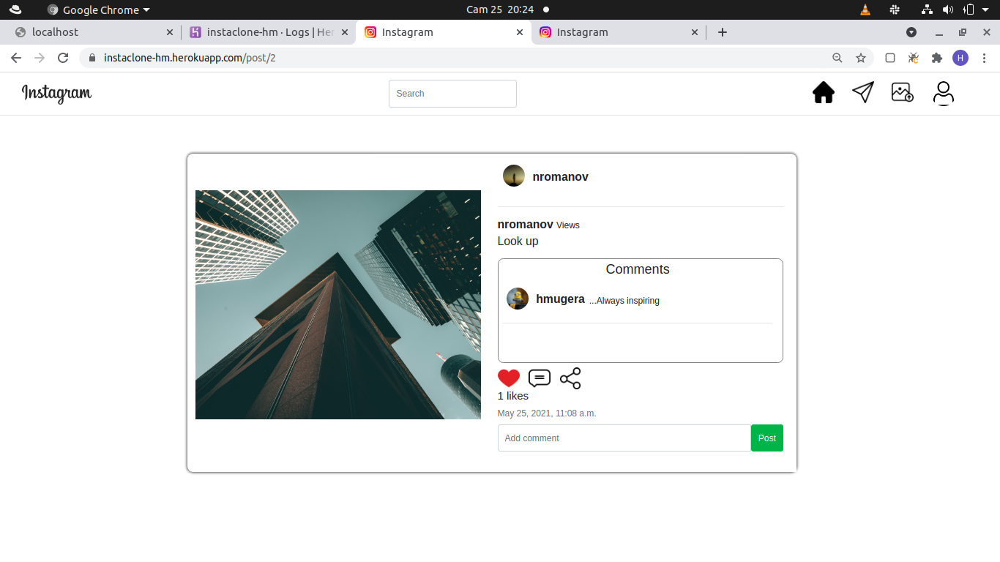

# Instagram Clone

# Description

This is an Instagram Clone website made with Django. A user can post, comment and view pictures posted on this App just like on Instagram.Also one can follow and unfollow other users and search for users by their user name

## Screenshot

1. Login page

2. Landing page

   

3. Single post view

4. User profile view

   

5. Upload view

   

6. Admin view

   

## Live Link

[Instagram Clone](https://instaclone-hm.herokuapp.com)

## Author

[Mugera Hughes](https://github.com/mugerah/)

## User Story

1. Sign in to the application to start using.
2. Upload my pictures to the application.
3. See my profile with all my pictures.
4. Follow other users and see their pictures on my timeline.
5. Like a picture and leave a comment on it.

## Behaviour Driven Development (BDD)

1. Sign Up

| Behaviour              |                Input                 |                               Output |
| ---------------------- | :----------------------------------: | -----------------------------------: |
| Allow user to register | user details email,username,password | User account and profile are created |

2. Login

| Behaviour                                |         Input         |                                                                                  Output |
| ---------------------------------------- | :-------------------: | --------------------------------------------------------------------------------------: |
| Allow user to login into the application | Username and password | If user is registered and has correct credentials he/she is redirected to the home page |

3. Search User

| Behaviour                   |          Input           |                                                                                                       Output |
| --------------------------- | :----------------------: | -----------------------------------------------------------------------------------------------------------: |
| Search for user by username | User username searchterm | User gets redirected to search user page where a list of users with relation to the searchterm are displayed |

4. Follow and unfollow other users

| Behaviour                 |                                 Input                                 |                                            Output |
| ------------------------- | :-------------------------------------------------------------------: | ------------------------------------------------: |
| Follow or unfollow a user | Click follow button to follow a user and unfollow to unfollow a users | Number of followers increases or decreases by one |

5. Like and unlike a post

| Behaviour                    |    Input    |                        Output |
| ---------------------------- | :---------: | ----------------------------: |
| Click on like icon on a post | like status | Increase number of likes by 1 |

6. Comment on post

| Behaviour                          |  Input  |                         Output |
| ---------------------------------- | :-----: | -----------------------------: |
| Click on icon comment on the posts | comment | The added comment is displayed |

## Setup/Installation Requirements

### Getting the code

1. clone repository
   https://github.com/MugeraH/instagram-clone.git
2. Move to the folder and install requirements
   cd instagram_clone
   pip install -r requirements.txt

### Database

1. Set up Database,and put your username and password in the code

2. Make migrations
   python3 manage.py makemigrations photos

3. Migrate
   python3 manage.py migrate

### Running the Application

1. Run main apllication

   - python3 manage.py runserver

2. Run tests
   - python3 manage.py test photos

## Technologies Used

- Python3
- Django 3.2
- Bootstrap
- PostgreSQL
- CSS
- Heroku
- Cloudinary

## Contact Information

For any further inquiries or contributions or comments, reach me at [Mugera Hughes](https://github.com/MugeraH)

### License

[MIT License](https://github.com/MugeraH/instagram-clone/blob/main/license)

Copyright (c) 2021
